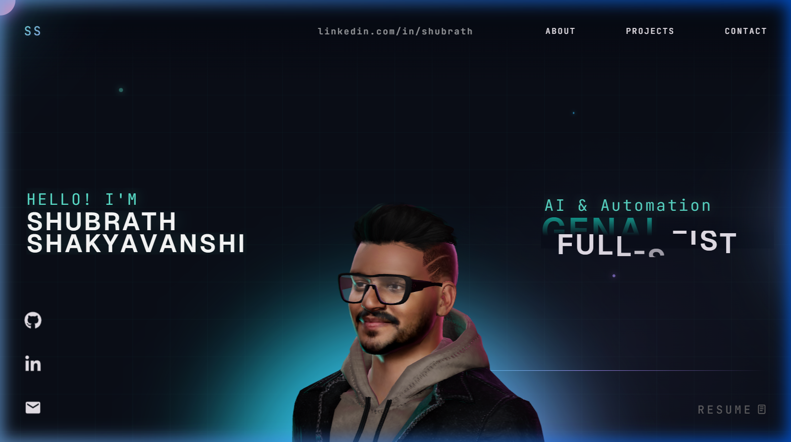

<p align="center">
  
</p>

<h1 align="center">Shubrath Shakyavanshi — Portfolio</h1>

<p align="center">
  <b>AI & Automation Engineer · GenAI Specialist · Full-Stack Developer</b>
</p>

<p align="center">
  <a href="https://shubrath.vercel.app">🌐 Live Site</a> &nbsp;·&nbsp;
  <a href="https://www.linkedin.com/in/shubrath/">💼 LinkedIn</a> &nbsp;·&nbsp;
  <a href="https://github.com/shubrath">🐙 GitHub</a> &nbsp;·&nbsp;
  <a href="mailto:ssshubrath@gmail.com">✉️ Email</a>
</p>

---

## ✨ Overview

An interactive 3D portfolio featuring a real-time avatar with head-tracking, scroll-driven cinematic animations, and a physics-based tech stack scene — built to showcase my work in AI, automation, and full-stack development.

### Highlights

- 🎭 **3D Avatar** — Custom encrypted GLB model with real-time head-tracking that follows cursor/touch
- 🎬 **Cinematic Scroll** — GSAP ScrollSmoother with parallax, section reveals, and character camera transitions
- ⚡ **Mobile Optimized** — Adaptive rendering (30fps throttle, capped pixel ratio, no HDR/shadows on mobile)
- 🧊 **Physics Tech Stack** — Interactive 3D spheres powered by Rapier physics engine (desktop)
- ✨ **30+ Micro-Animations** — Shimmer text, glow pulses, neon borders, floating particles, border sweeps
- 🔐 **Model Encryption** — AES-256-CBC encrypted model with runtime decryption via Web Crypto API

---

## 🛠️ Tech Stack

| Category | Technologies |
|----------|-------------|
| **Frontend** | React 18, TypeScript, Vite |
| **3D Engine** | Three.js, React Three Fiber, Drei, Rapier Physics |
| **Animation** | GSAP (ScrollSmoother, ScrollTrigger, SplitText) |
| **Styling** | Vanilla CSS, CSS Animations, Google Fonts (Geist, JetBrains Mono) |
| **Deployment** | Vercel |
| **Other** | Web Crypto API, Draco Compression, HDR Environment Maps |

---

## 📁 Project Structure

```
.
├── public/
│   ├── draco/                 # Draco decoder for model compression
│   ├── images/                # Project screenshots & assets
│   └── models/                # Encrypted 3D model + HDR environment
├── src/
│   ├── components/
│   │   ├── Character/         # 3D scene, renderer, lighting, animation
│   │   │   ├── Scene.tsx      # WebGL renderer + render loop
│   │   │   └── utils/         # character.ts, lighting.ts, decrypt.ts
│   │   ├── styles/            # Per-component CSS modules
│   │   ├── utils/             # GsapScroll.ts, initialFX.ts
│   │   ├── Landing.tsx        # Hero section with 3D avatar
│   │   ├── About.tsx          # About me section
│   │   ├── WhatIDo.tsx        # Services/skills cards
│   │   ├── Career.tsx         # Timeline experience
│   │   ├── Work.tsx           # Projects carousel
│   │   ├── TechStack.tsx      # 3D physics tech spheres
│   │   └── Contact.tsx        # Contact & social links
│   ├── data/                  # Static content definitions
│   └── App.tsx                # Root component
├── package.json
└── vite.config.ts
```

---

## 🚀 Getting Started

### Prerequisites

- Node.js 18+
- npm 9+

### Installation

```bash
# Clone the repo
git clone https://github.com/ShubrathS/Ssshuabrath.git
cd Ssshuabrath

# Install dependencies
npm install

# Start dev server
npm run dev
```

Open `http://localhost:5173` in your browser.

---

## 📜 Available Scripts

| Command | Description |
|---------|-------------|
| `npm run dev` | Start Vite dev server with host exposure |
| `npm run build` | Type-check + production build |
| `npm run preview` | Serve production build locally |
| `npm run lint` | Run ESLint checks |

---

## 🎨 Sections

| Section | Description |
|---------|-------------|
| **Landing** | Hero with 3D avatar, animated text, floating particles, scroll indicator |
| **About** | Shimmer text reveal with gradient line-draw animation |
| **What I Do** | Neon-bordered skill cards (GenAI, Automation, Full-Stack) |
| **Career** | Timeline with glow ripple cards and pulsing dot animation |
| **Projects** | Carousel with shine-sweep hover effects and gradient borders |
| **Tech Stack** | Interactive 3D physics scene with bouncing tech spheres |
| **Contact** | Social links, education, certifications with typewriter cursor |

---

## ⚡ Performance

Mobile optimizations applied to keep the 3D avatar smooth on smartphones:

- **Pixel ratio** capped at 1.5x on mobile devices
- **Antialiasing** disabled on mobile
- **Render loop** throttled to ~30fps on mobile
- **Shadow maps** reduced from 1024px to 256px
- **HDR environment** skipped entirely on mobile
- **Mesh shadows** disabled on mobile
- **Power preference** set to `low-power` on mobile

---

## 📄 License

This project is open source and available under the [MIT License](LICENSE).

---

<p align="center">
  Designed & Developed by <b>Shubrath Shakyavanshi</b> · © 2026
</p>
